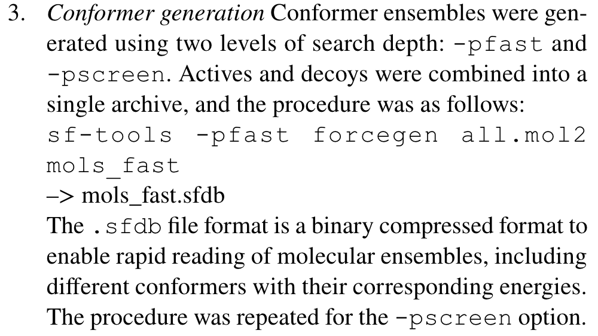

# 1 File Tree
## 1.1 Root
```shell
.
└── DUD-E
    ├── aa2ar
    ├── abl1
    ├── ace
    ├── aces
    ├── ada
    ├── ada17
    ├── adrb1
    ├── adrb2
    ├── akt1
    ├── akt2
    ├── aldr
    ├── ampc
    ├── andr
    ├── aofb
    ├── bace1
    ├── braf
    ├── cah2
    ├── casp3
    ├── cdk2
    ├── comt
    ├── cp2c9
    ├── cp3a4
    ├── csf1r
    ├── cxcr4
    ├── def
    ├── dhi1
    ├── dpp4
    ├── drd3
    ├── dyr
    ├── egfr
    ├── esr1
    ├── esr2
    ├── fa10
    ├── fa7
    ├── fabp4
    ├── fak1
    ├── fgfr1
    ├── fkb1a
    ├── fnta
    ├── fpps
    ├── gcr
    ├── glcm
    ├── gria2
    ├── grik1
    ├── hdac2
    ├── hdac8
    ├── hivint
    ├── hivpr
    ├── hivrt
    ├── hmdh
    ├── hs90a
    ├── hxk4
    ├── igf1r
    ├── inha
    ├── ital
    ├── jak2
    ├── kif11
    ├── kit
    ├── kith
    ├── kpcb
    ├── lck
    ├── lkha4
    ├── mapk2
    ├── mcr
    ├── met
    ├── mk01
    ├── mk10
    ├── mk14
    ├── mmp13
    ├── mp2k1
    ├── nos1
    ├── nram
    ├── pa2ga
    ├── parp1
    ├── pde5a
    ├── pgh1
    ├── pgh2
    ├── plk1
    ├── pnph
    ├── ppara
    ├── ppard
    ├── pparg
    ├── prgr
    ├── ptn1
    ├── pur2
    ├── pygm
    ├── pyrd
    ├── reni
    ├── rock1
    ├── rxra
    ├── sahh
    ├── src
    ├── tgfr1
    ├── thb
    ├── thrb
    ├── try1
    ├── tryb1
    ├── tysy
    ├── urok
    ├── vgfr2
    ├── wee1
    └── xiap

103 directories

```

## 1.2 Target Example
```shell
./pde5a
├── actives_final.ism # clustered ligands
├── actives_final.mol2
├── actives_final.sdf.gz
├── crystal_ligand.mol2 # unambiguous cocrystal ligand as prepared by DOCK Blaster
├── decoys_final.ism # clustered decoys
├── decoys_final.mol2.gz
├── decoys_final.sdf.gz
└── receptor.pdb # 

0 directories, 8 files
```

# 2 Data Scale


# 3 Data Construction
## 3.1 Data Extraction
1. Targets
    - 38 targets from DUD 
        >Forty protein targets were selected based on the availability of annotated ligands, crystal structures and, often, previous docking studies
    - new
        > we favored new target classes with pharmacological precedence
    - many ligands and crystal structures
        > we sought targets with many ligands and crystal structures, as they likely reflect a combination of target relevance and ease of study
    - modestly enrich known ligands
        > we preferred targets that could modestly enrich known ligands using fully automated docking, as these may be both easy to prepare and amenable to docking
2. Ligands
    > Ligands assigned to protein targets (ChEMBL confidence score ≥4) with affinities (IC50, EC50, Ki, Kd, and log variants thereof) of 1 μM or better were extracted from the ChEMBL09 database
3. Decoys
    - experimental decoys
        > we assigned experimental decoys as molecules with no measurable affinity at 30 μM or higher (greater than relation only)

<div style='text-align:center'>
    
</div>
## 3.2 Ligand Prepare
- Conformers
  - Ligand conformations were generated by OpenEye’s Omega.
<div style='text-align:center'>
    
</div>
## 3.3 Decoys Generation
- Why DUD-E should ensure that decoys and ligands are not similar？
    - 2-D chemical dissimilarity filter to prevent decoys from being active
<div style='text-align:center'>
    
</div>

# 4 Usage
## 4.1 Code
- [esp-sim](https://chemrxiv.org/engage/chemrxiv/article-details/6182a7f68ac7a22cf566624d)
  - [benchmark_4_dud-4.ipynb](https://github.com/hesther/espsim/blob/master/benchmarks/benchmark_4_dud-e.ipynb)
## 4.2 Describtion
- [ACPC](https://doi.org/10.1186/1758-2946-6-23)
    > For each of the 40 targets, the query was the last ligand in the ligands list of each target.
- [eSim](https://doi.org/10.1007/s10822-019-00236-6)
  1. Cognate ligand
    <div style='text-align:center'>
        
    </div>

  2. Initial Structure 3D Generation
    <div style='text-align:center'>
        
    </div>

  3. Conformer generation
    <div style='text-align:center'>
        
    </div>
